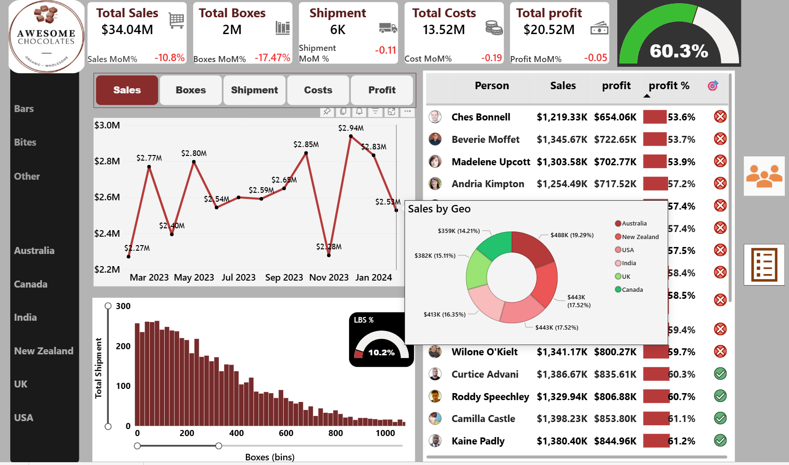

# Awesome Chocolates-Sales and Profit Performance Dashboard

## Project Overview

  This Power BI dashboard analzes the overall sales performance of Awesome Chocolates across products, shipments and regions.
This dashboard provides insights into revenue trends, profitability, product contribution, and shipment distribution to
support data-driven business decisions.

## Business Objective
To evaluate
- Total Sales and profit performance
- Month-on-month (MoM) growth trend
- Product wise profitability
- Prepresentative wise profitability
- Shipment and box distribution patterns
- Profit margin efficiency

The goal is to identify high-performing products and improvement areas in cost and shipment operations

## Key KPIs
Metric Value
- Total Sales
- Total Boxes
- Total Shipments
- Total Cost
- Total Profit

## Dashboard Features

- ✔ KPI Summary cards with MoM % Change
- ✔ Month-wise sales trend analysis
- ✔ Shipment Distribution (Histogram View)
- ✔ Product-wise sales and profit comparision
- ✔ Prepresentative-wise sales and profit comparision
- ✔ Profit performance indicators
- ✔ LBS% performance gauge
- ✔ Interactive navigation (Sales, Boxes, Shipments, Costs, Profit)
- ✔ Country filter

## Visual Insights Included
- line chart shows monthly performance fluctuations with KPI Tooltip
- product ranking table with Sales, profit, Profit%, LBS% and profit tarket
- Representative ranking table with Sales, profit, Profit%,profit tarket

## Tools and Technologies Used

- Dax (measure & calculations)
- Data Modeling
- Data Cleaning and Transformation
- Interactive visualization designs

## Key Business Insights

  1. **Strong overall profitability**
  - The company maintains a 60.3% profit margin, indicating effective pricing
strategy and cost control
     
  2. **High-performing products**
  - Peanut butter cubes - 87.1% profit margin (Top Performer)
  - Smooth Silky Salty – 84.4% profit margin
  - Orange choco - 79.5% profit margin

 3. **Low-performing products**
  - Baker's Choco Chips - 17.4% profit margin (low Performer)  
  - Drinking Coco – 26.7% profit margin
  - 50% Dark Bites - 27.2% profit margin

  **Recommendation:**

  - Review pricing strategy
  - Analyze production & logistics cost
  - Consider discontinuation if margin doesn’t improve

4. **High_performing Employees**
   
   - Marney O'Breen 66.7% profit margin (Top Performer)
   - Kelci Walkden 65.1% profit margin
   - Van Tuxwell 64.7% profit margin
  
5. **Low_performing Employees**
   
   - Ches Bonnell 53.6% profit margin (low Performer)
   - Beverie Moffet 53.7% profit margin
   - Madelene Upcott 53.9% profit margin
     
6. **Monthly Trend Fluctuation**

   - 

 

